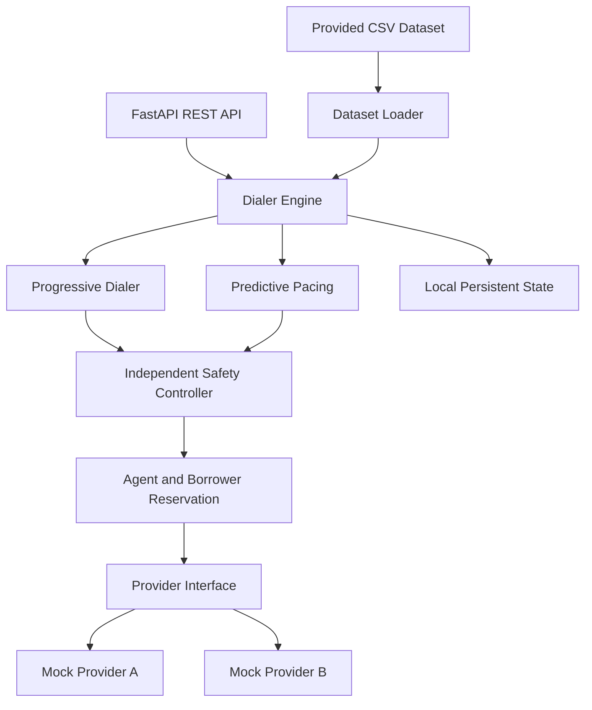

# Architecture

```mermaid
flowchart TD
 A[FastAPI REST API] --> B[Dialer Engine]
 B --> C[Progressive Dialer]
 B --> D[Predictive Pacing]
 C --> E[Independent Safety Controller]
 D --> E
 E --> F[Agent and Borrower Reservation]
 F --> G[Provider Interface]
 G --> H[Mock Provider A]
 G --> I[Mock Provider B]
 B --> J[Local Persistent State]
 K[Provided CSV Dataset] --> L[Dataset Loader]
 L --> B
```

The prototype is a modular monolith. Replace local state with PostgreSQL transactions and row locks before deploying multiple worker processes.
